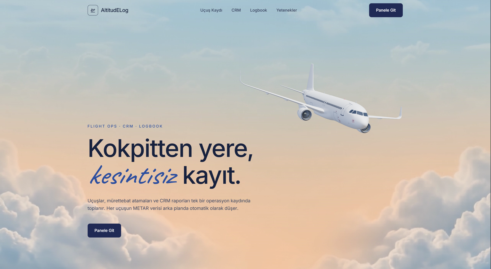
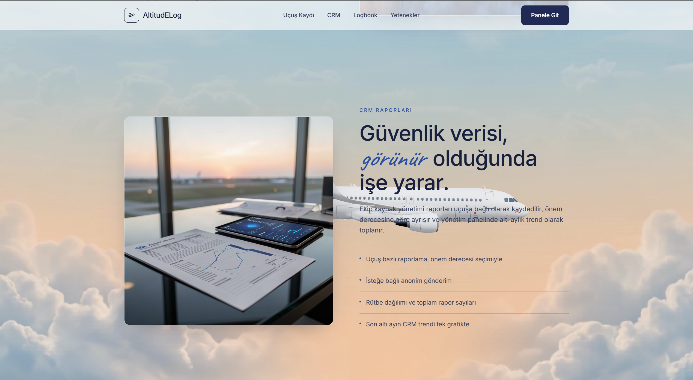
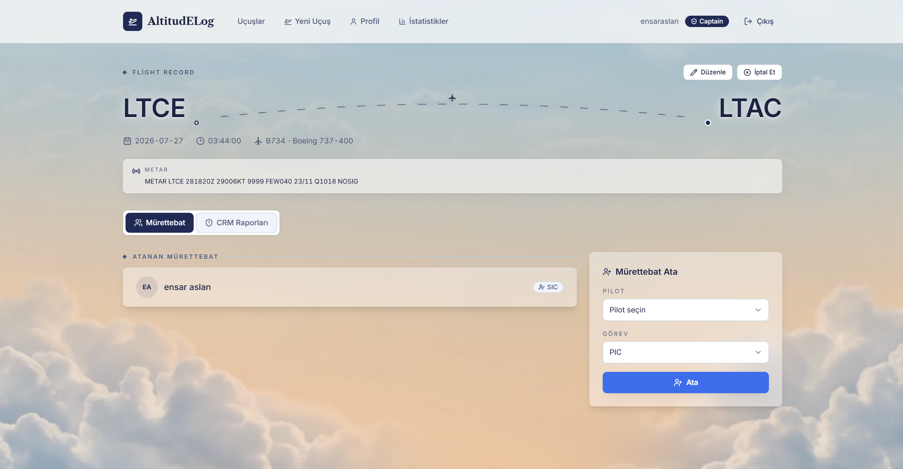
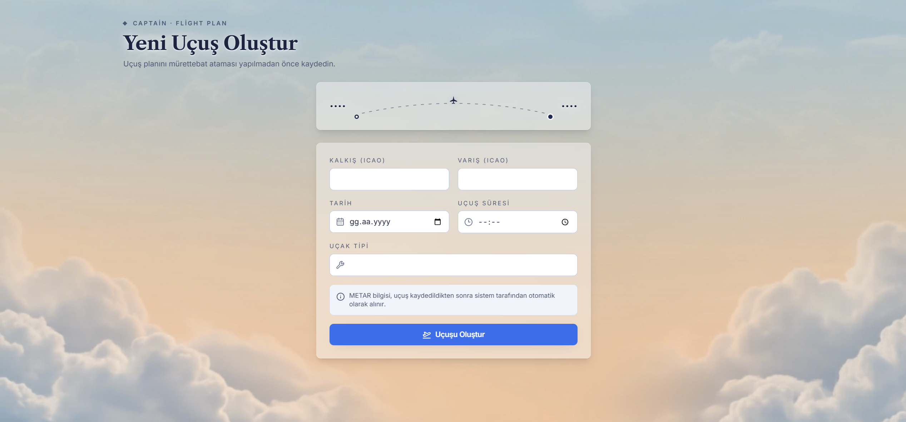
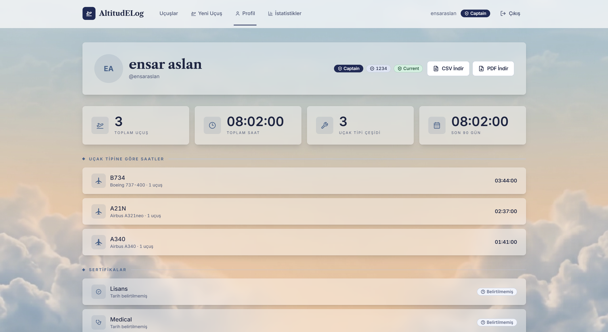
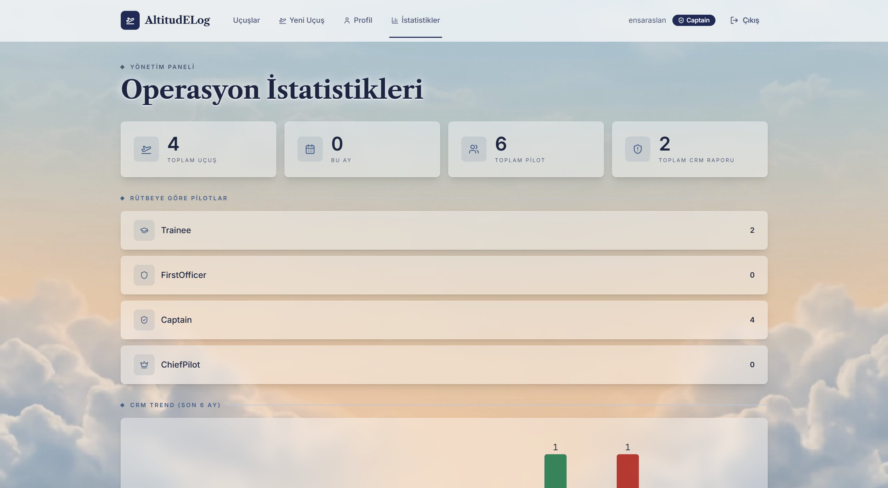

# ✈️ AltitudELog

[🇹🇷 Türkçe](README.md) | [🇬🇧 English](README.en.md)

[](https://github.com/EnsarAslannn/AltitudELog/actions/workflows/ci.yml)

A modern flight and crew resource management (CRM) logging system built with .NET, enabling pilots to
register, log flights, assign crew with per-flight duty roles, and file CRM safety reports tied to specific flights.

**🔗 Live demo:** [altitudelog.vercel.app](https://altitudelog.vercel.app) — register with any rank, including
**Captain**, to unlock flight creation and crew management features.

## 📌 About the Project

AltitudELog is a comprehensive flight and crew management platform that allows pilots to register with a rank,
create and manage flights, assign crew members to flights with specific duty roles, and file optional anonymous
CRM (Crew Resource Management) safety reports tied to individual flights.

Flight data is automatically enriched with weather information — when a flight is created, a background job
fetches the METAR report for the departure airport and attaches it to the flight record.

The project demonstrates not just basic flight logging, but a full-stack application with role-based authorization,
background job processing, caching strategies, and modern CI/CD & containerized deployment.

## ⚙️ Key Features

### ✈️ Flight Management

- Create flights with departure and arrival airport information
- View flight list and detailed flight information
- Flight creation restricted to command ranks (Captain, Chief Pilot)

### 👥 Crew Assignment & Duty Roles

- Assign multiple crew members to each flight
- Crew members receive flight-specific duty role assignments
- Pilot rank determines authorization level throughout the system

### 📝 CRM Safety Reporting

- File CRM (Crew Resource Management) safety reports tied to specific flights
- Reports can optionally be submitted anonymously
- Non-punitive reporting workflow supporting safety culture

### 🌦️ Automatic Weather Enrichment

- Background job (Hangfire) triggered on flight creation
- METAR weather report fetched from external service for departure airport
- External API call decoupled from write path — user gets immediate response

### 🔐 Role-Based Authorization

- Pilot rank encoded as JWT role claim
- Write operations (flight/crew creation) restricted to command ranks
- Same authorization rules applied on frontend with route guards
- Per-record rules live in the handler rather than the controller, so they cannot be
  routed around: a logbook export is limited to its owner or a command rank

### ⚡ Caching & Background Processing

- Frequently queried data cached in Redis
- Cache records automatically invalidated on updates
- Graceful degradation if cache service is unavailable (fail-open approach)

### 🩺 Operational Endpoints

- `/health` — real-time liveness checks for database and cache with per-check timings
- `/hangfire` — password-protected background job dashboard
- Swagger/Scalar — interactive API documentation

## 🏗️ Project Architecture

Built on Clean Architecture principles with layered separation:

```
Domain          → Core entities (Pilot, Flight, Crew, CRMReport) — no external dependencies
Application     → CQRS commands/queries, validation rules, caching abstractions
Infrastructure  → Database access, JWT issuance, Redis, Hangfire, METAR client
API             → Controllers, application entry point
```

Frontend developed as a separate React + TypeScript project, decoupled from the backend.

This architecture ensures the project is readable, testable, and easily extensible.

## 🛠️ Technology Stack

**Backend**

- .NET 10, ASP.NET Core Web API
- PostgreSQL (Entity Framework Core)
- Redis (distributed caching)
- Hangfire (background job queue)
- FluentValidation, Serilog, JWT authentication

**Frontend**

- React 19 + TypeScript
- Vite
- Tailwind CSS 4
- Zustand, Axios, React Router

**Testing**

- xUnit, NSubstitute
- Testcontainers (real Postgres & Redis integration tests)

**Deployment**

- API: Docker container on Railway
- Frontend: Vercel

## 🚀 Getting Started

### Prerequisites

- [.NET 10 SDK](https://dotnet.microsoft.com/download)
- [Node.js](https://nodejs.org/) 22+
- Docker (for Postgres and Redis services)

### Backend

```bash
docker compose up -d

dotnet user-secrets set "Jwt:Key" "<a real key, at least 32 characters>" \
  --project src/AltitudELog.API

dotnet restore
dotnet build AltitudELog.slnx

dotnet ef database update --project src/AltitudELog.Infrastructure --startup-project src/AltitudELog.API

dotnet run --project src/AltitudELog.API --launch-profile http   # http://localhost:5264
```

### Frontend

```bash
cd frontend
npm install
npm run dev      # http://localhost:5180
```

### Running Tests

```bash
dotnet test AltitudELog.slnx
```

> Docker must be running for integration tests to execute.

## 📸 Screenshots

**Home Page**

<p align="center">


</p>

**Dashboard**

<p align="center">

</p>

**Create New Flight**

<p align="center">

</p>

**Profile**

<p align="center">

</p>

**Statistics**

<p align="center">

</p>

## 📄 License

MIT — see [LICENSE](./LICENSE).
